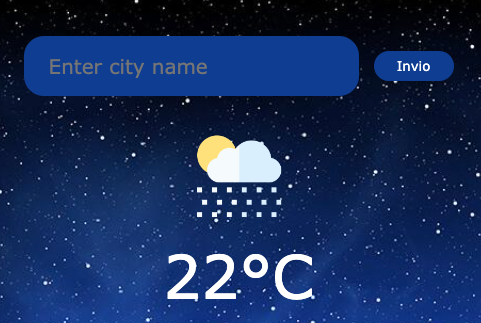

# MeteoApp
# Weather App

## Descrizione
Weather App è un'applicazione per le previsioni del tempo. Ti consente di cercare le previsioni meteo per una determinata città e visualizzarne i dettagli, come la temperatura, l'umidità e la velocità del vento.

## Caratteristiche
- Ricerca delle previsioni meteo per una determinata città
- Visualizzazione delle informazioni dettagliate sulla temperatura, l'umidità e il vento
- Icone del tempo che rappresentano le condizioni meteorologiche attuali

## Tecnologie utilizzate
- HTML
- CSS
- JavaScript
- API di OpenWeatherMap per i dati meteorologici

## Installazione
1. Clona il repository su un server locale o scarica il codice sorgente.
2. Apri il file `index.html` nel tuo browser web.

## Utilizzo
1. Inserisci il nome della città desiderata nell'input di ricerca.
2. Premi il pulsante "Enter" o fai clic sul pulsante di ricerca.
3. Verranno visualizzate le previsioni meteo per la città specificata.

## Licenza
Questo progetto è concesso in licenza con i termini dell'Open Source License.

## Contatti
- Autore: Daniele Camodeca
- Email: danielecamodeca@email.com

